[powered-image]: https://img.shields.io/badge/Powered%20by-Extension.js-0971fe?logo=extension.js&logoColor=white&style=flat
[powered-url]: https://extension.js.org
[action-image]: https://img.shields.io/github/actions/workflow/status/extension-js/examples/ci.yml?branch=main&label=CI&logo=github&color=2ecc40&style=flat
[action-url]: https://github.com/extension-js/examples/actions
[chromium-image]: https://img.shields.io/badge/Chromium-Compatible-4285F4?logo=googlechrome&logoColor=white&style=flat
[chromium-url]: https://www.chromium.org
[firefox-image]: https://img.shields.io/badge/Firefox-Compatible-FF7139?logo=firefox-browser&logoColor=white&style=flat
[firefox-url]: https://www.mozilla.org/firefox/
[discord-image]: https://img.shields.io/discord/1253608412890271755?label=Discord&logo=discord&style=flat&color=2ecc40
[discord-url]: https://discord.gg/v9h2RgeTSN

[![Powered by Extension.js][powered-image]][powered-url] [![CI][action-image]][action-url] [![chromium][chromium-image]][chromium-url] [![firefox][firefox-image]][firefox-url] [![discord][discord-image]][discord-url]

# Extension.js Examples

> A collection of browser extension examples

This repository contains browser extension examples built with Extension.js. Each example demonstrates different patterns, frameworks, and use cases for building cross-browser extensions.

## Web standards and framework support

|  |  |  |  |  |  |  |
| :---------------------------------------------------------------------------------------------------------------------: | :---------------------------------------------------------------------------------------------------------------------: | :---------------------------------------------------------------------------------------------------------------------: | :---------------------------------------------------------------------------------------------------------------------: | :---------------------------------------------------------------------------------------------------------------------: | :---------------------------------------------------------------------------------------------------------------------: | :---------------------------------------------------------------------------------------------------------------------: |
|                             ESNext [Try out](https://templates.extension.dev/javascript)                             |                           TypeScript [Try out](https://templates.extension.dev/typescript)                           |                           WASM [Try out](https://templates.extension.dev/transformers-js)                            |                                React [Try out](https://templates.extension.dev/react)                                |                                  Vue [Try out](https://templates.extension.dev/vue)                                  |                               Svelte [Try out](https://templates.extension.dev/svelte)                               |                               Preact [Try out](https://templates.extension.dev/preact)                               |

## Examples

### Sidebar

  
 JavaScript Example

> JavaScript-based extension with a sidebar panel. Adds a sidebar with a simple page.

  <table>
    <tr>
      <td>Repository</td>
      <td align="right"><a href="https://github.com/extension-js/examples/blob/main/examples/javascript/README.md">examples/javascript</a></td>
      <td rowspan="5"></td>
    </tr>
    <tr><td>Version</td><td align="right">3.0.0</td></tr>
    <tr><td>Context</td><td align="right">Content Script, Sidebar, Background</td></tr>
    <tr><td>JavaScript framework</td><td align="right">JavaScript</td></tr>
    <tr><td>CSS</td><td align="right">CSS</td></tr>
    <tr>
      <td>Background included</td>
      <td align="right">Yes</td>
      <td align="center"><a href="https://templates.extension.dev/javascript">Start with this template &#8599;</a></td>
    </tr>
  </table>

  
 React Example

> React-based extension with a sidebar panel. Adds a sidebar with a simple page.

  <table>
    <tr>
      <td>Repository</td>
      <td align="right"><a href="https://github.com/extension-js/examples/blob/main/examples/react/README.md">examples/react</a></td>
      <td rowspan="5">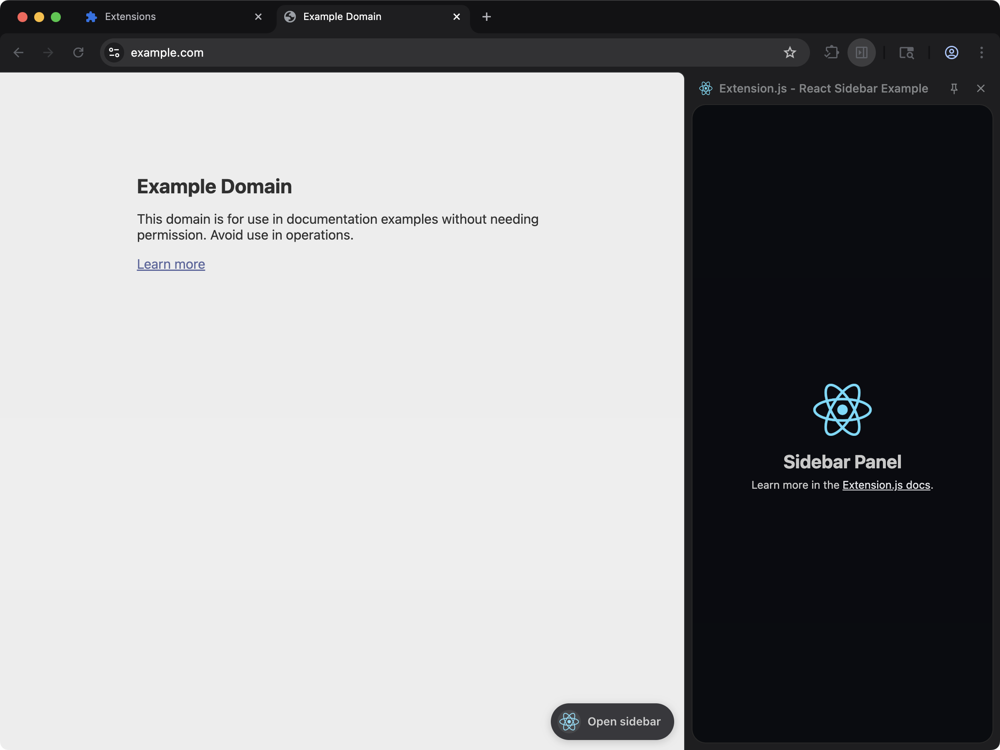</td>
    </tr>
    <tr><td>Version</td><td align="right">3.0.0</td></tr>
    <tr><td>Context</td><td align="right">Content Script, Sidebar, Background</td></tr>
    <tr><td>JavaScript framework</td><td align="right">React</td></tr>
    <tr><td>CSS</td><td align="right">CSS</td></tr>
    <tr>
      <td>Background included</td>
      <td align="right">Yes</td>
      <td align="center"><a href="https://templates.extension.dev/react">Start with this template &#8599;</a></td>
    </tr>
  </table>

  
 Preact Example

> Preact-based extension with a sidebar panel. Adds a sidebar with a simple page.

  <table>
    <tr>
      <td>Repository</td>
      <td align="right"><a href="https://github.com/extension-js/examples/blob/main/examples/preact/README.md">examples/preact</a></td>
      <td rowspan="5">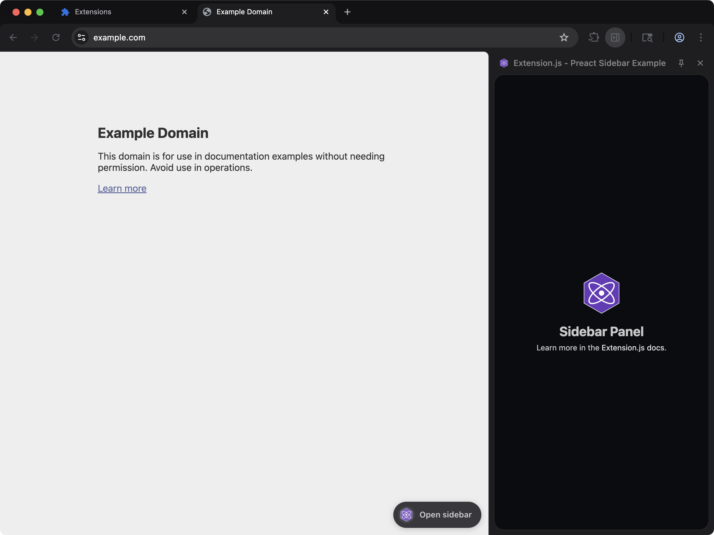</td>
    </tr>
    <tr><td>Version</td><td align="right">3.0.0</td></tr>
    <tr><td>Context</td><td align="right">Content Script, Sidebar, Background</td></tr>
    <tr><td>JavaScript framework</td><td align="right">Preact</td></tr>
    <tr><td>CSS</td><td align="right">CSS</td></tr>
    <tr>
      <td>Background included</td>
      <td align="right">Yes</td>
      <td align="center"><a href="https://templates.extension.dev/preact">Start with this template &#8599;</a></td>
    </tr>
  </table>

  
 Svelte Example

> Svelte-based extension with a sidebar panel. Adds a sidebar with a simple page.

  <table>
    <tr>
      <td>Repository</td>
      <td align="right"><a href="https://github.com/extension-js/examples/blob/main/examples/svelte/README.md">examples/svelte</a></td>
      <td rowspan="5">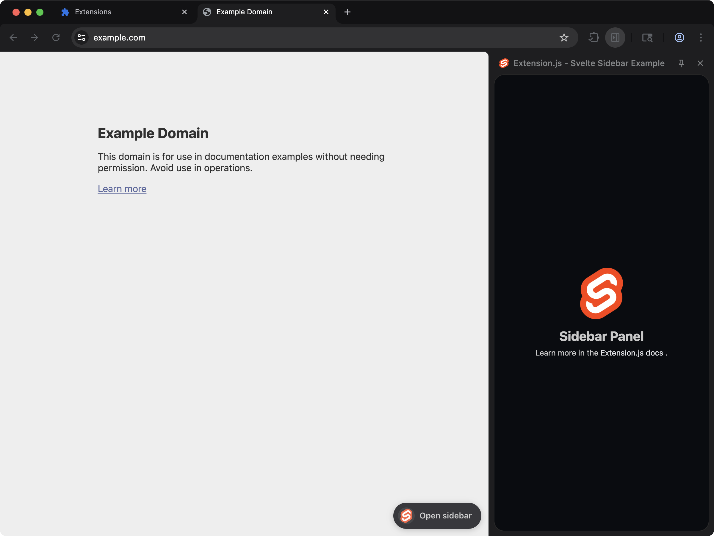</td>
    </tr>
    <tr><td>Version</td><td align="right">3.0.0</td></tr>
    <tr><td>Context</td><td align="right">Content Script, Sidebar, Background</td></tr>
    <tr><td>JavaScript framework</td><td align="right">Svelte</td></tr>
    <tr><td>CSS</td><td align="right">CSS</td></tr>
    <tr>
      <td>Background included</td>
      <td align="right">Yes</td>
      <td align="center"><a href="https://templates.extension.dev/svelte">Start with this template &#8599;</a></td>
    </tr>
  </table>

  
 Vue Example

> Vue.js-based extension with a sidebar panel. Adds a sidebar with a simple page.

  <table>
    <tr>
      <td>Repository</td>
      <td align="right"><a href="https://github.com/extension-js/examples/blob/main/examples/vue/README.md">examples/vue</a></td>
      <td rowspan="5"></td>
    </tr>
    <tr><td>Version</td><td align="right">3.0.0</td></tr>
    <tr><td>Context</td><td align="right">Content Script, Sidebar, Background</td></tr>
    <tr><td>JavaScript framework</td><td align="right">Vue</td></tr>
    <tr><td>CSS</td><td align="right">CSS</td></tr>
    <tr>
      <td>Background included</td>
      <td align="right">Yes</td>
      <td align="center"><a href="https://templates.extension.dev/vue">Start with this template &#8599;</a></td>
    </tr>
  </table>

  
 TypeScript Example

> TypeScript-based extension with a sidebar panel. Adds a sidebar with a simple page.

  <table>
    <tr>
      <td>Repository</td>
      <td align="right"><a href="https://github.com/extension-js/examples/blob/main/examples/typescript/README.md">examples/typescript</a></td>
      <td rowspan="5">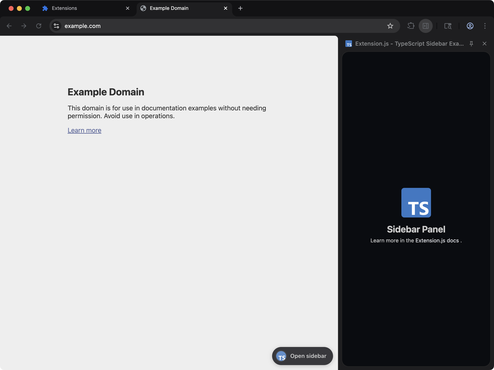</td>
    </tr>
    <tr><td>Version</td><td align="right">3.0.0</td></tr>
    <tr><td>Context</td><td align="right">Content Script, Sidebar, Background</td></tr>
    <tr><td>JavaScript framework</td><td align="right">JavaScript</td></tr>
    <tr><td>CSS</td><td align="right">CSS</td></tr>
    <tr>
      <td>Background included</td>
      <td align="right">Yes</td>
      <td align="center"><a href="https://templates.extension.dev/typescript">Start with this template &#8599;</a></td>
    </tr>
  </table>

  
 Sidebar Example

> Sidebar panel example. Adds a sidebar to the browser with a simple page.

  <table>
    <tr>
      <td>Repository</td>
      <td align="right"><a href="https://github.com/extension-js/examples/blob/main/examples/sidebar/README.md">examples/sidebar</a></td>
      <td rowspan="5">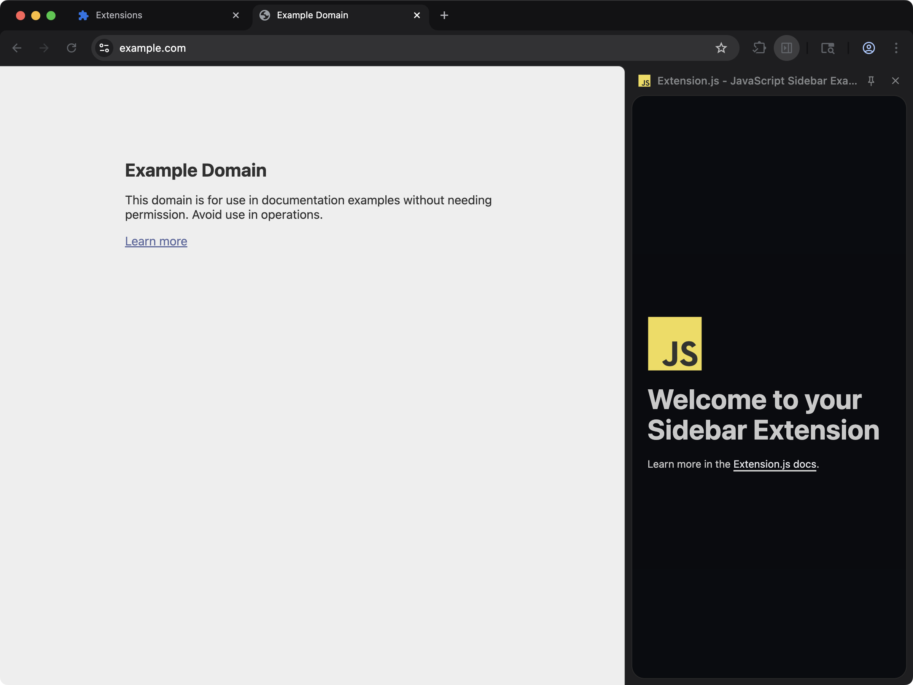</td>
    </tr>
    <tr><td>Version</td><td align="right">0.0.1</td></tr>
    <tr><td>Context</td><td align="right">Sidebar, Background</td></tr>
    <tr><td>JavaScript framework</td><td align="right">JavaScript</td></tr>
    <tr><td>CSS</td><td align="right">CSS</td></tr>
    <tr>
      <td>Background included</td>
      <td align="right">Yes</td>
      <td align="center"><a href="https://templates.extension.dev/sidebar">Start with this template &#8599;</a></td>
    </tr>
  </table>

  
 Sidebar Shadcn Example

> React sidebar example using shadcn/ui components. Adds a sidebar panel with a simple React page.

  <table>
    <tr>
      <td>Repository</td>
      <td align="right"><a href="https://github.com/extension-js/examples/blob/main/examples/sidebar-shadcn/README.md">examples/sidebar-shadcn</a></td>
      <td rowspan="5">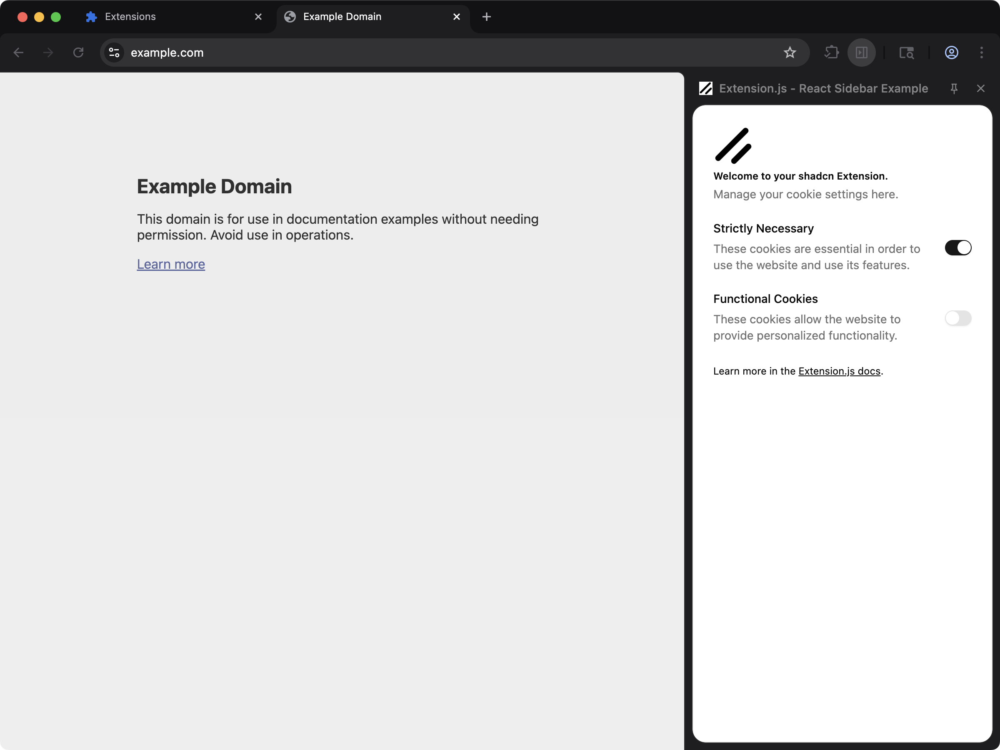</td>
    </tr>
    <tr><td>Version</td><td align="right">0.0.1</td></tr>
    <tr><td>Context</td><td align="right">Sidebar, Background</td></tr>
    <tr><td>JavaScript framework</td><td align="right">React</td></tr>
    <tr><td>CSS</td><td align="right">CSS</td></tr>
    <tr>
      <td>Background included</td>
      <td align="right">Yes</td>
      <td align="center"><a href="https://templates.extension.dev/sidebar-shadcn">Start with this template &#8599;</a></td>
    </tr>
  </table>

  
 Transformers JS Example

> Transformers.js demo with a sidebar and a content script: classify the active page or your selection on-device via WebGPU/WASM.

  <table>
    <tr>
      <td>Repository</td>
      <td align="right"><a href="https://github.com/extension-js/examples/blob/main/examples/transformers-js/README.md">examples/transformers-js</a></td>
      <td rowspan="5">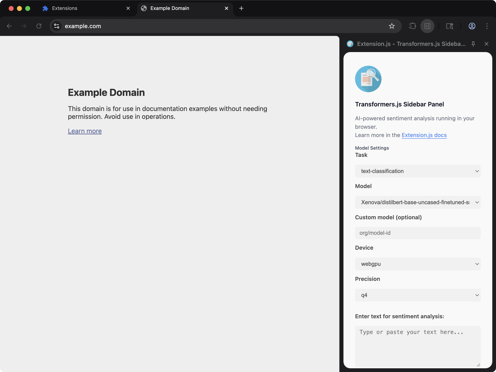</td>
    </tr>
    <tr><td>Version</td><td align="right">1.0.0</td></tr>
    <tr><td>Context</td><td align="right">Content, Sidebar, Background</td></tr>
    <tr><td>JavaScript framework</td><td align="right">JavaScript</td></tr>
    <tr><td>CSS</td><td align="right">CSS</td></tr>
    <tr>
      <td>Background included</td>
      <td align="right">Yes</td>
      <td align="center"><a href="https://templates.extension.dev/transformers-js">Start with this template &#8599;</a></td>
    </tr>
  </table>

  
 Sidebar Monorepo Turbopack Example

> Monorepo example with content script and sidebar.

  <table>
    <tr>
      <td>Repository</td>
      <td align="right"><a href="https://github.com/extension-js/examples/blob/main/examples/sidebar-monorepo-turbopack/README.md">examples/sidebar-monorepo-turbopack</a></td>
      <td rowspan="5">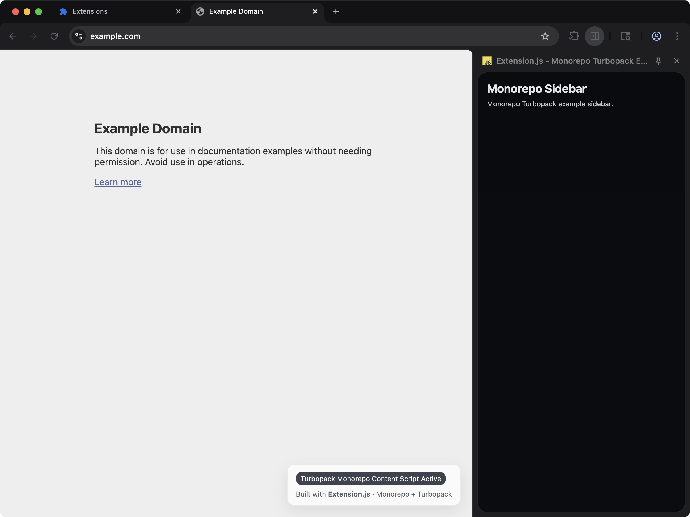</td>
    </tr>
    <tr><td>Version</td><td align="right">0.0.1</td></tr>
    <tr><td>Context</td><td align="right">Content Script, Sidebar, Background</td></tr>
    <tr><td>JavaScript framework</td><td align="right">JavaScript</td></tr>
    <tr><td>CSS</td><td align="right">CSS</td></tr>
    <tr>
      <td>Background included</td>
      <td align="right">Yes</td>
      <td align="center"><a href="https://templates.extension.dev/sidebar-monorepo-turbopack">Start with this template &#8599;</a></td>
    </tr>
  </table>

### Action

  
 Action Example

> Action popup example. Opens a toolbar popup with a simple page.

  <table>
    <tr>
      <td>Repository</td>
      <td align="right"><a href="https://github.com/extension-js/examples/blob/main/examples/action/README.md">examples/action</a></td>
      <td rowspan="5">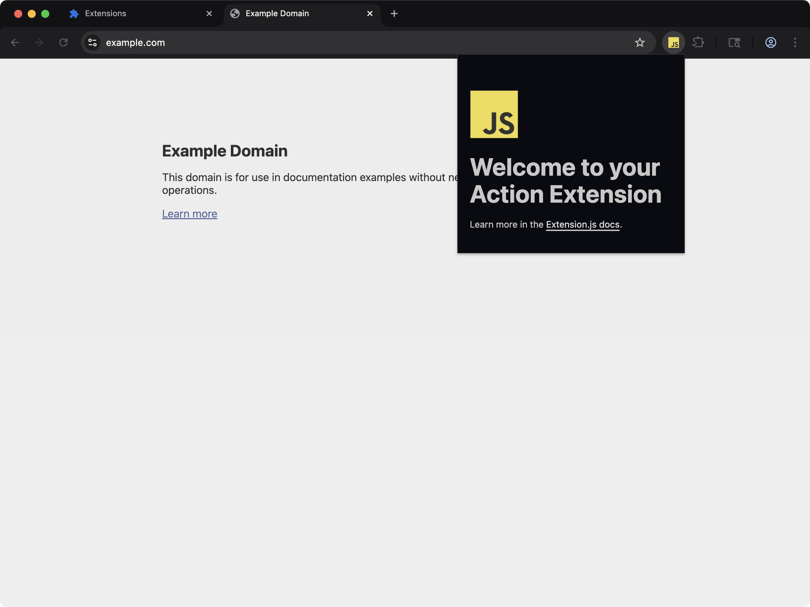</td>
    </tr>
    <tr><td>Version</td><td align="right">0.0.1</td></tr>
    <tr><td>Context</td><td align="right">Action, Background</td></tr>
    <tr><td>JavaScript framework</td><td align="right">JavaScript</td></tr>
    <tr><td>CSS</td><td align="right">CSS</td></tr>
    <tr>
      <td>Background included</td>
      <td align="right">Yes</td>
      <td align="center"><a href="https://templates.extension.dev/action">Start with this template &#8599;</a></td>
    </tr>
  </table>

  
 Action ChatGPT Example

> React action popup example. Opens a toolbar popup and renders a basic React UI.

  <table>
    <tr>
      <td>Repository</td>
      <td align="right"><a href="https://github.com/extension-js/examples/blob/main/examples/action-chatgpt/README.md">examples/action-chatgpt</a></td>
      <td rowspan="5"></td>
    </tr>
    <tr><td>Version</td><td align="right">0.0.1</td></tr>
    <tr><td>Context</td><td align="right">Action, Background</td></tr>
    <tr><td>JavaScript framework</td><td align="right">React</td></tr>
    <tr><td>CSS</td><td align="right">CSS</td></tr>
    <tr>
      <td>Background included</td>
      <td align="right">Yes</td>
      <td align="center"><a href="https://templates.extension.dev/action-chatgpt">Start with this template &#8599;</a></td>
    </tr>
  </table>

  
 Action Locales Example

> Action popup example demonstrating i18n with \_locales and message placeholders.

  <table>
    <tr>
      <td>Repository</td>
      <td align="right"><a href="https://github.com/extension-js/examples/blob/main/examples/action-locales/README.md">examples/action-locales</a></td>
      <td rowspan="5"></td>
    </tr>
    <tr><td>Version</td><td align="right">0.0.1</td></tr>
    <tr><td>Context</td><td align="right">Action, Background</td></tr>
    <tr><td>JavaScript framework</td><td align="right">JavaScript</td></tr>
    <tr><td>CSS</td><td align="right">CSS</td></tr>
    <tr>
      <td>Background included</td>
      <td align="right">Yes</td>
      <td align="center"><a href="https://templates.extension.dev/action-locales">Start with this template &#8599;</a></td>
    </tr>
  </table>

### Content

  
 Content Example

> Content script example that injects a small badge into web pages to demonstrate DOM injection and styling in an extension.

  <table>
    <tr>
      <td>Repository</td>
      <td align="right"><a href="https://github.com/extension-js/examples/blob/main/examples/content/README.md">examples/content</a></td>
      <td rowspan="5"></td>
    </tr>
    <tr><td>Version</td><td align="right">0.0.1</td></tr>
    <tr><td>Context</td><td align="right">Content Script, Background</td></tr>
    <tr><td>JavaScript framework</td><td align="right">JavaScript</td></tr>
    <tr><td>CSS</td><td align="right">CSS</td></tr>
    <tr>
      <td>Background included</td>
      <td align="right">Yes</td>
      <td align="center"><a href="https://templates.extension.dev/content">Start with this template &#8599;</a></td>
    </tr>
  </table>

  
 Content CSS Modules Example

> Content script example styled with CSS Modules. Injects a small badge and shows how to scope styles in content scripts.

  <table>
    <tr>
      <td>Repository</td>
      <td align="right"><a href="https://github.com/extension-js/examples/blob/main/examples/content-css-modules/README.md">examples/content-css-modules</a></td>
      <td rowspan="5">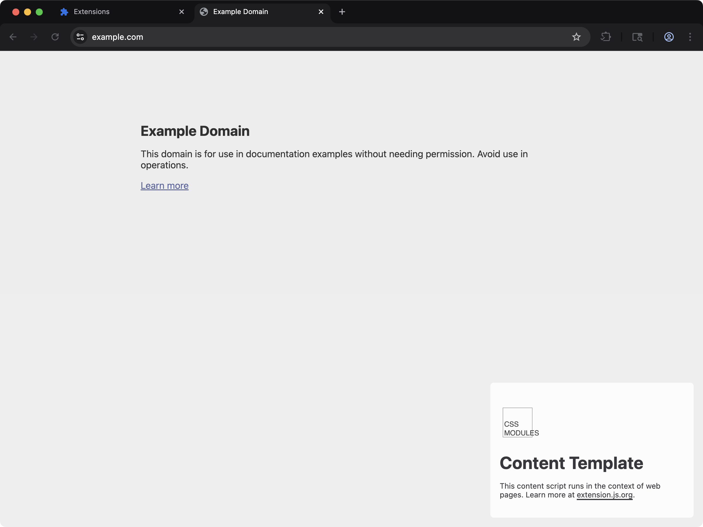</td>
    </tr>
    <tr><td>Version</td><td align="right">0.0.1</td></tr>
    <tr><td>Context</td><td align="right">Content Script, Background</td></tr>
    <tr><td>JavaScript framework</td><td align="right">JavaScript</td></tr>
    <tr><td>CSS</td><td align="right">CSS</td></tr>
    <tr>
      <td>Background included</td>
      <td align="right">Yes</td>
      <td align="center"><a href="https://templates.extension.dev/content-css-modules">Start with this template &#8599;</a></td>
    </tr>
  </table>

  
 Content Custom Font Example

> Content script example that loads custom web fonts. Demonstrates font files and web_accessible_resources setup.

  <table>
    <tr>
      <td>Repository</td>
      <td align="right"><a href="https://github.com/extension-js/examples/blob/main/examples/content-custom-font/README.md">examples/content-custom-font</a></td>
      <td rowspan="5">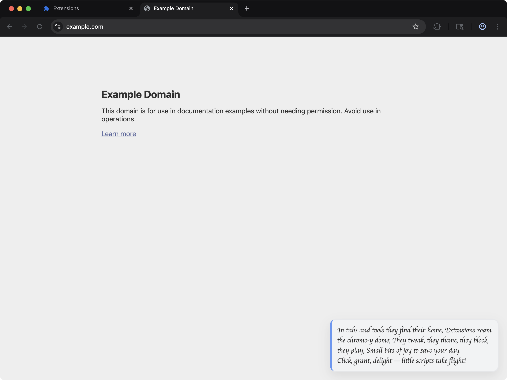</td>
    </tr>
    <tr><td>Version</td><td align="right">0.0.1</td></tr>
    <tr><td>Context</td><td align="right">Content Script, Background</td></tr>
    <tr><td>JavaScript framework</td><td align="right">JavaScript</td></tr>
    <tr><td>CSS</td><td align="right">CSS</td></tr>
    <tr>
      <td>Background included</td>
      <td align="right">Yes</td>
      <td align="center"><a href="https://templates.extension.dev/content-custom-font">Start with this template &#8599;</a></td>
    </tr>
  </table>

  
 Content Env Example

> Content script example that reads environment variables (.env) and renders a small UI.

  <table>
    <tr>
      <td>Repository</td>
      <td align="right"><a href="https://github.com/extension-js/examples/blob/main/examples/content-env/README.md">examples/content-env</a></td>
      <td rowspan="5">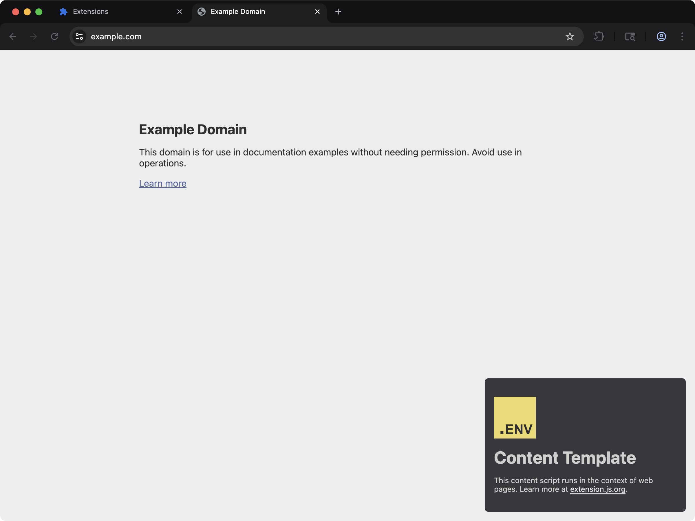</td>
    </tr>
    <tr><td>Version</td><td align="right">0.0.1</td></tr>
    <tr><td>Context</td><td align="right">Content Script, Background</td></tr>
    <tr><td>JavaScript framework</td><td align="right">JavaScript</td></tr>
    <tr><td>CSS</td><td align="right">CSS</td></tr>
    <tr>
      <td>Background included</td>
      <td align="right">Yes</td>
      <td align="center"><a href="https://templates.extension.dev/content-env">Start with this template &#8599;</a></td>
    </tr>
  </table>

  
 Content Less Example

> Content script example styled with Less. Injects a small badge and shows how to organize styles with Less in content scripts.

  <table>
    <tr>
      <td>Repository</td>
      <td align="right"><a href="https://github.com/extension-js/examples/blob/main/examples/content-less/README.md">examples/content-less</a></td>
      <td rowspan="5">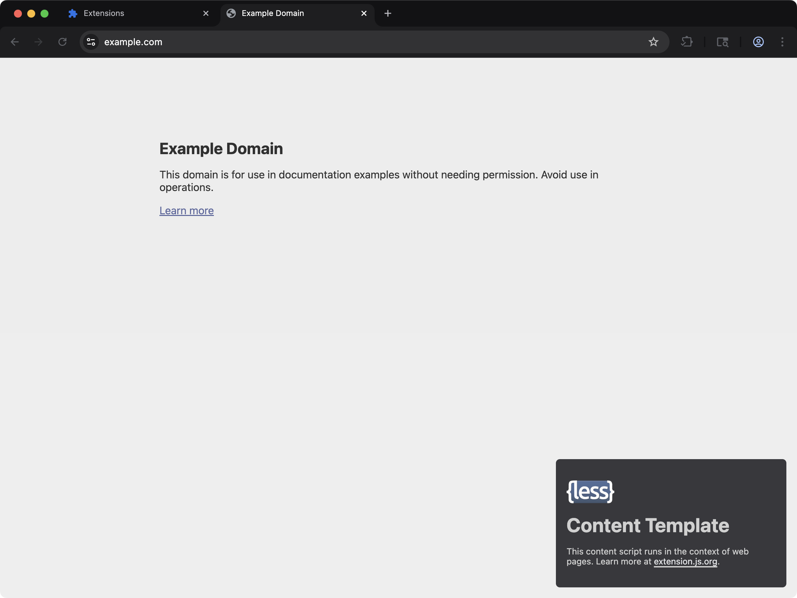</td>
    </tr>
    <tr><td>Version</td><td align="right">0.0.1</td></tr>
    <tr><td>Context</td><td align="right">Content Script, Background</td></tr>
    <tr><td>JavaScript framework</td><td align="right">JavaScript</td></tr>
    <tr><td>CSS</td><td align="right">Less</td></tr>
    <tr>
      <td>Background included</td>
      <td align="right">Yes</td>
      <td align="center"><a href="https://templates.extension.dev/content-less">Start with this template &#8599;</a></td>
    </tr>
  </table>

  
 Content Less Modules Example

> Content script example using Less with CSS Modules. Injects a small badge and shows how to scope Less styles in content scripts.

  <table>
    <tr>
      <td>Repository</td>
      <td align="right"><a href="https://github.com/extension-js/examples/blob/main/examples/content-less-modules/README.md">examples/content-less-modules</a></td>
      <td rowspan="5"></td>
    </tr>
    <tr><td>Version</td><td align="right">0.0.1</td></tr>
    <tr><td>Context</td><td align="right">Content Script, Background</td></tr>
    <tr><td>JavaScript framework</td><td align="right">JavaScript</td></tr>
    <tr><td>CSS</td><td align="right">Less</td></tr>
    <tr>
      <td>Background included</td>
      <td align="right">Yes</td>
      <td align="center"><a href="https://templates.extension.dev/content-less-modules">Start with this template &#8599;</a></td>
    </tr>
  </table>

  
 Content Multi One Entry Example

> Content script example with four scripts listed in one entry. Each script injects a small element.

  <table>
    <tr>
      <td>Repository</td>
      <td align="right"><a href="https://github.com/extension-js/examples/blob/main/examples/content-multi-one-entry/README.md">examples/content-multi-one-entry</a></td>
      <td rowspan="5">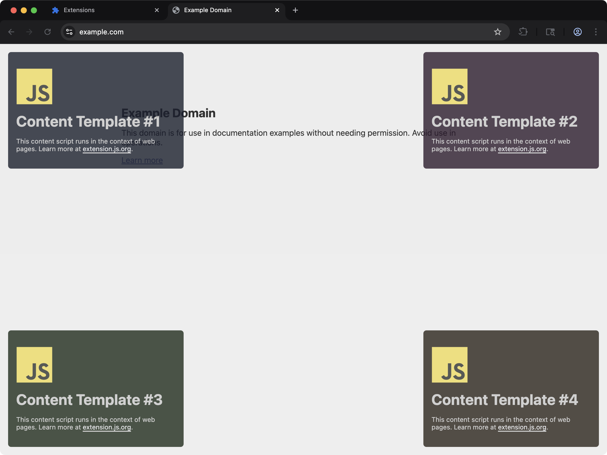</td>
    </tr>
    <tr><td>Version</td><td align="right">0.0.1</td></tr>
    <tr><td>Context</td><td align="right">Content Script, Background</td></tr>
    <tr><td>JavaScript framework</td><td align="right">JavaScript</td></tr>
    <tr><td>CSS</td><td align="right">CSS</td></tr>
    <tr>
      <td>Background included</td>
      <td align="right">Yes</td>
      <td align="center"><a href="https://templates.extension.dev/content-multi-one-entry">Start with this template &#8599;</a></td>
    </tr>
  </table>

  
 Content Multi Three Entries Example

> Content script example split across three entries (2 + 1 + 1). Each script injects a small element.

  <table>
    <tr>
      <td>Repository</td>
      <td align="right"><a href="https://github.com/extension-js/examples/blob/main/examples/content-multi-three-entries/README.md">examples/content-multi-three-entries</a></td>
      <td rowspan="5"></td>
    </tr>
    <tr><td>Version</td><td align="right">0.0.1</td></tr>
    <tr><td>Context</td><td align="right">Content Script, Background</td></tr>
    <tr><td>JavaScript framework</td><td align="right">JavaScript</td></tr>
    <tr><td>CSS</td><td align="right">CSS</td></tr>
    <tr>
      <td>Background included</td>
      <td align="right">Yes</td>
      <td align="center"><a href="https://templates.extension.dev/content-multi-three-entries">Start with this template &#8599;</a></td>
    </tr>
  </table>

  
 Content Preact Example

> Content script example rendered with Preact. Mounts a small UI inside a Shadow DOM on any page.

  <table>
    <tr>
      <td>Repository</td>
      <td align="right"><a href="https://github.com/extension-js/examples/blob/main/examples/content-preact/README.md">examples/content-preact</a></td>
      <td rowspan="5"></td>
    </tr>
    <tr><td>Version</td><td align="right">0.0.1</td></tr>
    <tr><td>Context</td><td align="right">Content Script, Background</td></tr>
    <tr><td>JavaScript framework</td><td align="right">Preact</td></tr>
    <tr><td>CSS</td><td align="right">CSS</td></tr>
    <tr>
      <td>Background included</td>
      <td align="right">Yes</td>
      <td align="center"><a href="https://templates.extension.dev/content-preact">Start with this template &#8599;</a></td>
    </tr>
  </table>

  
 Content React Example

> Content script example rendered with React. Mounts a small UI inside a Shadow DOM on any page.

  <table>
    <tr>
      <td>Repository</td>
      <td align="right"><a href="https://github.com/extension-js/examples/blob/main/examples/content-react/README.md">examples/content-react</a></td>
      <td rowspan="5"></td>
    </tr>
    <tr><td>Version</td><td align="right">0.0.1</td></tr>
    <tr><td>Context</td><td align="right">Content Script, Background</td></tr>
    <tr><td>JavaScript framework</td><td align="right">React</td></tr>
    <tr><td>CSS</td><td align="right">CSS</td></tr>
    <tr>
      <td>Background included</td>
      <td align="right">Yes</td>
      <td align="center"><a href="https://templates.extension.dev/content-react">Start with this template &#8599;</a></td>
    </tr>
  </table>

  
 Content Sass Example

> Content script example styled with Sass. Injects a small badge and shows how to organize styles with Sass in content scripts.

  <table>
    <tr>
      <td>Repository</td>
      <td align="right"><a href="https://github.com/extension-js/examples/blob/main/examples/content-sass/README.md">examples/content-sass</a></td>
      <td rowspan="5"></td>
    </tr>
    <tr><td>Version</td><td align="right">0.0.1</td></tr>
    <tr><td>Context</td><td align="right">Content Script, Background</td></tr>
    <tr><td>JavaScript framework</td><td align="right">JavaScript</td></tr>
    <tr><td>CSS</td><td align="right">Sass</td></tr>
    <tr>
      <td>Background included</td>
      <td align="right">Yes</td>
      <td align="center"><a href="https://templates.extension.dev/content-sass">Start with this template &#8599;</a></td>
    </tr>
  </table>

  
 Content Sass Modules Example

> A browser extension content script example built with Extension.js using Sass CSS Modules. Demonstrates scoped styles for content scripts with Sass preprocessing.

  <table>
    <tr>
      <td>Repository</td>
      <td align="right"><a href="https://github.com/extension-js/examples/blob/main/examples/content-sass-modules/README.md">examples/content-sass-modules</a></td>
      <td rowspan="5">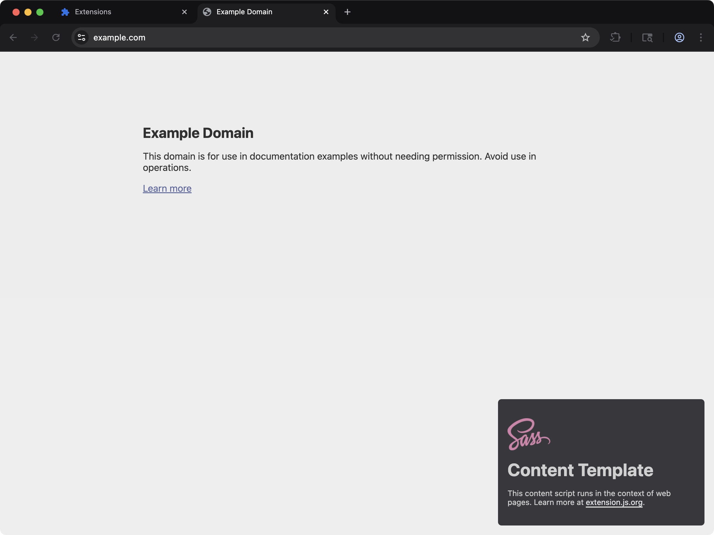</td>
    </tr>
    <tr><td>Version</td><td align="right">0.0.1</td></tr>
    <tr><td>Context</td><td align="right">Content Script, Background</td></tr>
    <tr><td>JavaScript framework</td><td align="right">JavaScript</td></tr>
    <tr><td>CSS</td><td align="right">Sass</td></tr>
    <tr>
      <td>Background included</td>
      <td align="right">Yes</td>
      <td align="center"><a href="https://templates.extension.dev/content-sass-modules">Start with this template &#8599;</a></td>
    </tr>
  </table>

  
 Content Svelte Example

> Content script example rendered with Svelte. Mounts a small UI inside a Shadow DOM on any page.

  <table>
    <tr>
      <td>Repository</td>
      <td align="right"><a href="https://github.com/extension-js/examples/blob/main/examples/content-svelte/README.md">examples/content-svelte</a></td>
      <td rowspan="5"></td>
    </tr>
    <tr><td>Version</td><td align="right">0.0.1</td></tr>
    <tr><td>Context</td><td align="right">Content Script, Background</td></tr>
    <tr><td>JavaScript framework</td><td align="right">Svelte</td></tr>
    <tr><td>CSS</td><td align="right">CSS</td></tr>
    <tr>
      <td>Background included</td>
      <td align="right">Yes</td>
      <td align="center"><a href="https://templates.extension.dev/content-svelte">Start with this template &#8599;</a></td>
    </tr>
  </table>

  
 Content TypeScript Example

> Content script example built with TypeScript. Mounts a small UI and uses typed modules.

  <table>
    <tr>
      <td>Repository</td>
      <td align="right"><a href="https://github.com/extension-js/examples/blob/main/examples/content-typescript/README.md">examples/content-typescript</a></td>
      <td rowspan="5">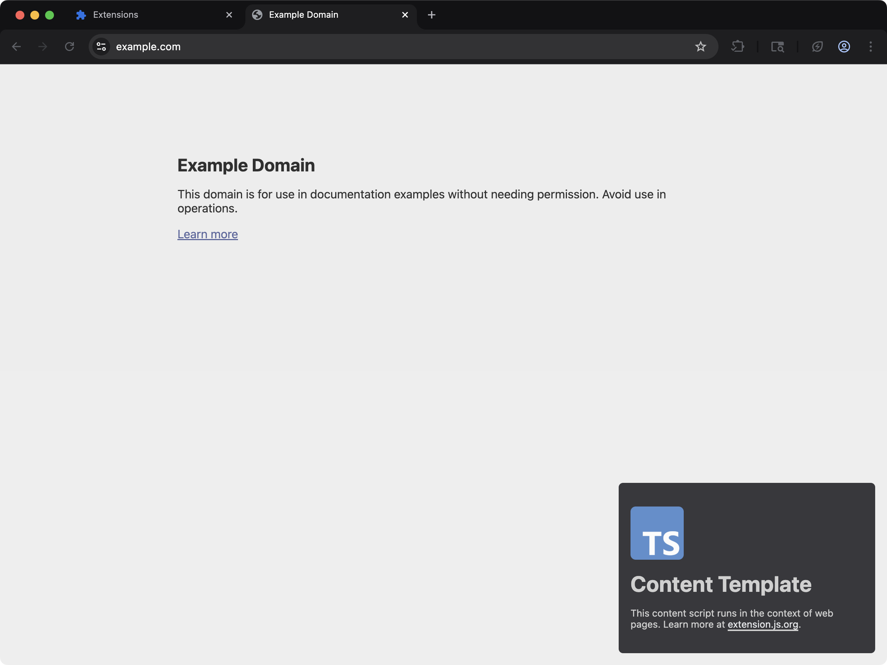</td>
    </tr>
    <tr><td>Version</td><td align="right">0.0.1</td></tr>
    <tr><td>Context</td><td align="right">Content Script, Background</td></tr>
    <tr><td>JavaScript framework</td><td align="right">JavaScript</td></tr>
    <tr><td>CSS</td><td align="right">CSS</td></tr>
    <tr>
      <td>Background included</td>
      <td align="right">Yes</td>
      <td align="center"><a href="https://templates.extension.dev/content-typescript">Start with this template &#8599;</a></td>
    </tr>
  </table>

  
 Content Vue Example

> Content script example rendered with Vue. Mounts a small UI inside a Shadow DOM on any page.

  <table>
    <tr>
      <td>Repository</td>
      <td align="right"><a href="https://github.com/extension-js/examples/blob/main/examples/content-vue/README.md">examples/content-vue</a></td>
      <td rowspan="5"></td>
    </tr>
    <tr><td>Version</td><td align="right">0.0.1</td></tr>
    <tr><td>Context</td><td align="right">Content Script, Background</td></tr>
    <tr><td>JavaScript framework</td><td align="right">Vue</td></tr>
    <tr><td>CSS</td><td align="right">CSS</td></tr>
    <tr>
      <td>Background included</td>
      <td align="right">Yes</td>
      <td align="center"><a href="https://templates.extension.dev/content-vue">Start with this template &#8599;</a></td>
    </tr>
  </table>

### New

  
 New Example

> New tab page example using plain JavaScript. Renders a simple page you can customize.

  <table>
    <tr>
      <td>Repository</td>
      <td align="right"><a href="https://github.com/extension-js/examples/blob/main/examples/new/README.md">examples/new</a></td>
      <td rowspan="5">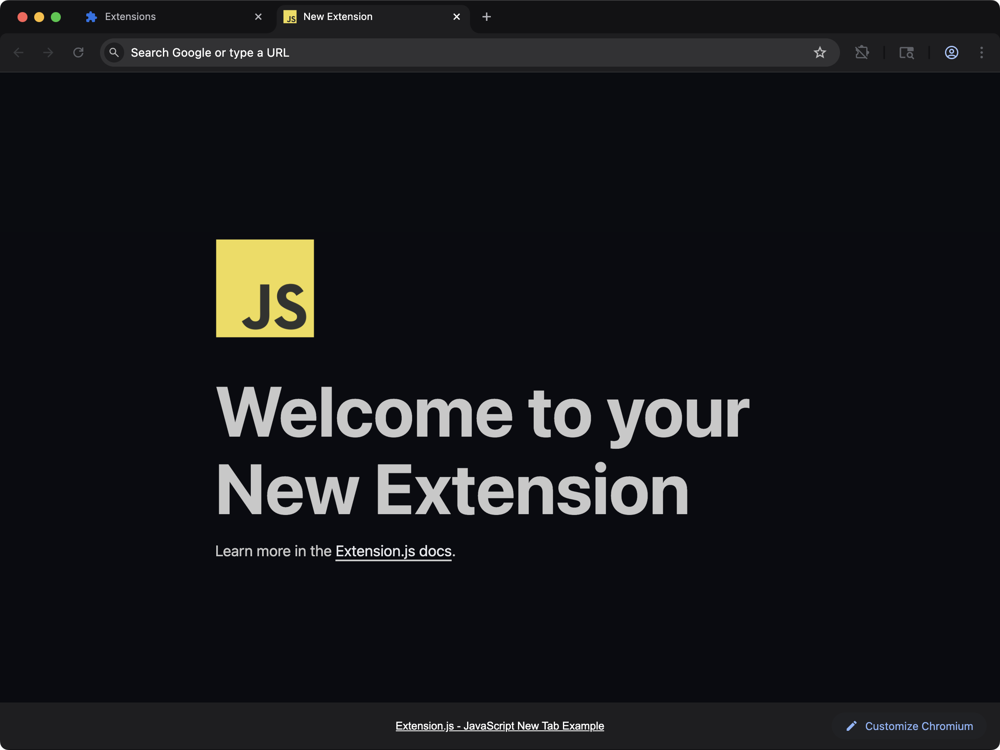</td>
    </tr>
    <tr><td>Version</td><td align="right">0.0.1</td></tr>
    <tr><td>Context</td><td align="right">New Tab, Background</td></tr>
    <tr><td>JavaScript framework</td><td align="right">JavaScript</td></tr>
    <tr><td>CSS</td><td align="right">CSS</td></tr>
    <tr>
      <td>Background included</td>
      <td align="right">Yes</td>
      <td align="center"><a href="https://templates.extension.dev/new">Start with this template &#8599;</a></td>
    </tr>
  </table>

  
 New Browser Flags Example

> A browser extension example built with Extension.js demonstrating browser-specific features and flags. Shows how to handle browser differences across targets.

  <table>
    <tr>
      <td>Repository</td>
      <td align="right"><a href="https://github.com/extension-js/examples/blob/main/examples/new-browser-flags/README.md">examples/new-browser-flags</a></td>
      <td rowspan="5"></td>
    </tr>
    <tr><td>Version</td><td align="right">0.0.1</td></tr>
    <tr><td>Context</td><td align="right">Content Script, New Tab, Sidebar, Background</td></tr>
    <tr><td>JavaScript framework</td><td align="right">JavaScript</td></tr>
    <tr><td>CSS</td><td align="right">CSS</td></tr>
    <tr>
      <td>Background included</td>
      <td align="right">Yes</td>
      <td align="center"><a href="https://templates.extension.dev/new-browser-flags">Start with this template &#8599;</a></td>
    </tr>
  </table>

  
 New Config ESLint Example

> New tab page example with ESLint configured. Shows how linting is set up in an extension project.

  <table>
    <tr>
      <td>Repository</td>
      <td align="right"><a href="https://github.com/extension-js/examples/blob/main/examples/new-config-eslint/README.md">examples/new-config-eslint</a></td>
      <td rowspan="5">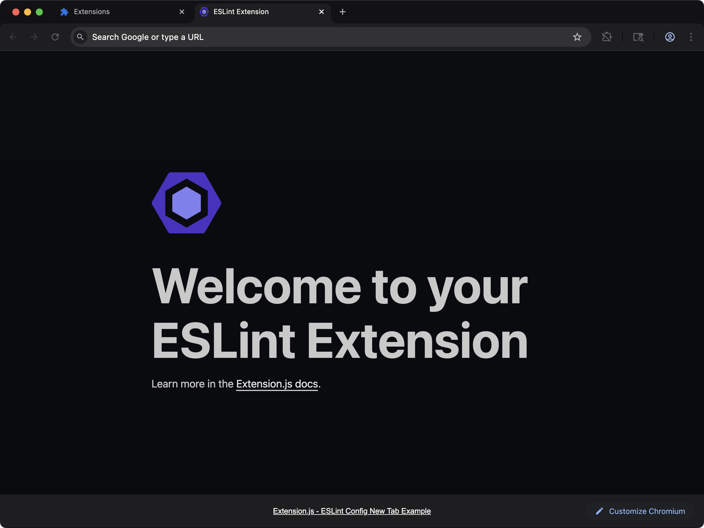</td>
    </tr>
    <tr><td>Version</td><td align="right">0.0.1</td></tr>
    <tr><td>Context</td><td align="right">New Tab, Background</td></tr>
    <tr><td>JavaScript framework</td><td align="right">JavaScript</td></tr>
    <tr><td>CSS</td><td align="right">CSS</td></tr>
    <tr>
      <td>Background included</td>
      <td align="right">Yes</td>
      <td align="center"><a href="https://templates.extension.dev/new-config-eslint">Start with this template &#8599;</a></td>
    </tr>
  </table>

  
 New Config Prettier Example

> New tab page example with Prettier configured. Shows how formatting is set up in an extension project.

  <table>
    <tr>
      <td>Repository</td>
      <td align="right"><a href="https://github.com/extension-js/examples/blob/main/examples/new-config-prettier/README.md">examples/new-config-prettier</a></td>
      <td rowspan="5">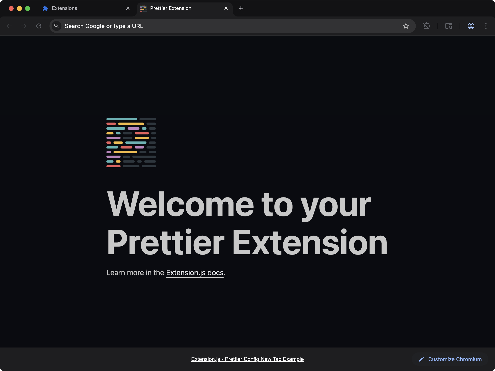</td>
    </tr>
    <tr><td>Version</td><td align="right">0.0.1</td></tr>
    <tr><td>Context</td><td align="right">New Tab, Background</td></tr>
    <tr><td>JavaScript framework</td><td align="right">JavaScript</td></tr>
    <tr><td>CSS</td><td align="right">CSS</td></tr>
    <tr>
      <td>Background included</td>
      <td align="right">Yes</td>
      <td align="center"><a href="https://templates.extension.dev/new-config-prettier">Start with this template &#8599;</a></td>
    </tr>
  </table>

  
 New Config Stylelint Example

> New tab page example with Stylelint configured. Shows how CSS linting is set up in an extension project.

  <table>
    <tr>
      <td>Repository</td>
      <td align="right"><a href="https://github.com/extension-js/examples/blob/main/examples/new-config-stylelint/README.md">examples/new-config-stylelint</a></td>
      <td rowspan="5">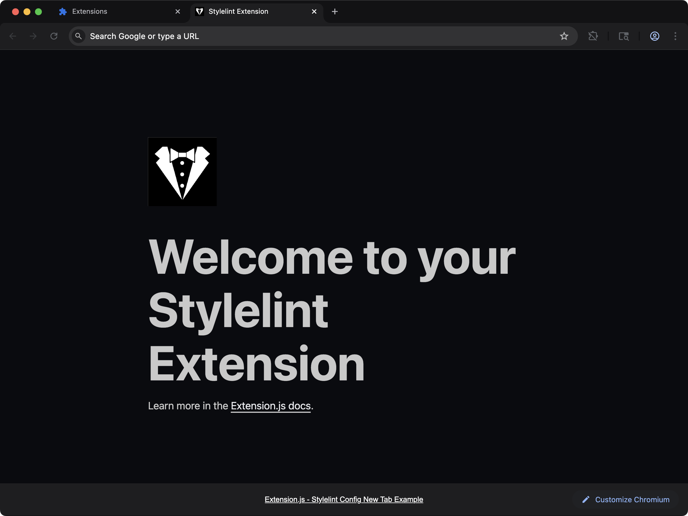</td>
    </tr>
    <tr><td>Version</td><td align="right">0.0.1</td></tr>
    <tr><td>Context</td><td align="right">New Tab, Background</td></tr>
    <tr><td>JavaScript framework</td><td align="right">JavaScript</td></tr>
    <tr><td>CSS</td><td align="right">Sass</td></tr>
    <tr>
      <td>Background included</td>
      <td align="right">Yes</td>
      <td align="center"><a href="https://templates.extension.dev/new-config-stylelint">Start with this template &#8599;</a></td>
    </tr>
  </table>

  
 New Crypto Example

> New tab page example demonstrating basic crypto operations inside an extension.

  <table>
    <tr>
      <td>Repository</td>
      <td align="right"><a href="https://github.com/extension-js/examples/blob/main/examples/new-crypto/README.md">examples/new-crypto</a></td>
      <td rowspan="5">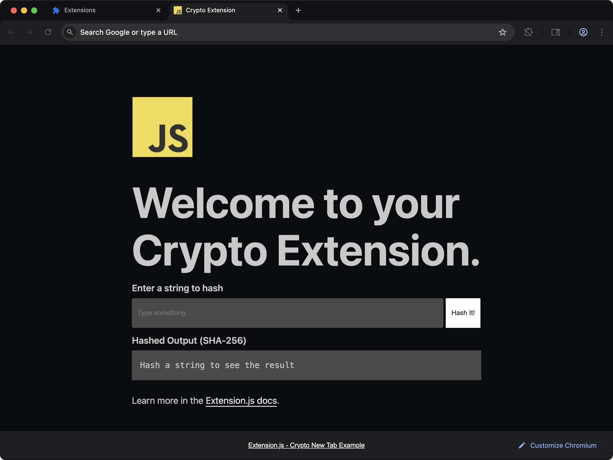</td>
    </tr>
    <tr><td>Version</td><td align="right">0.0.1</td></tr>
    <tr><td>Context</td><td align="right">New Tab, Background</td></tr>
    <tr><td>JavaScript framework</td><td align="right">JavaScript</td></tr>
    <tr><td>CSS</td><td align="right">CSS</td></tr>
    <tr>
      <td>Background included</td>
      <td align="right">Yes</td>
      <td align="center"><a href="https://templates.extension.dev/new-crypto">Start with this template &#8599;</a></td>
    </tr>
  </table>

  
 New Env Example

> New tab page example demonstrating environment variables (.env) in an extension project.

  <table>
    <tr>
      <td>Repository</td>
      <td align="right"><a href="https://github.com/extension-js/examples/blob/main/examples/new-env/README.md">examples/new-env</a></td>
      <td rowspan="5">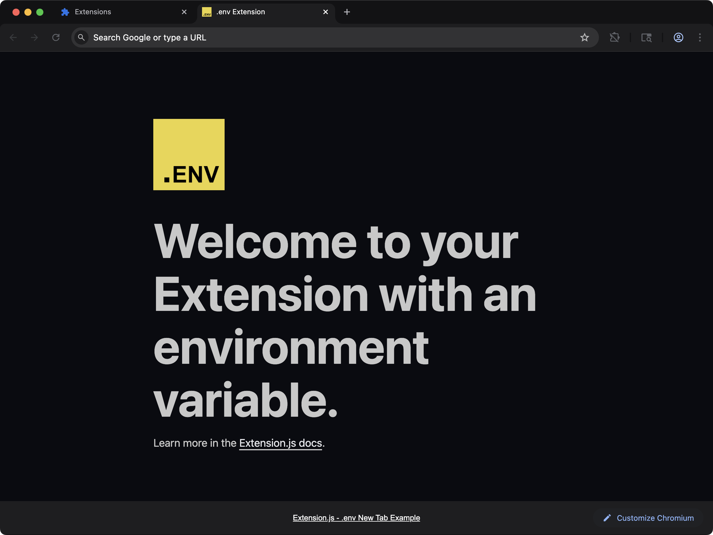</td>
    </tr>
    <tr><td>Version</td><td align="right">0.0.1</td></tr>
    <tr><td>Context</td><td align="right">New Tab, Background</td></tr>
    <tr><td>JavaScript framework</td><td align="right">JavaScript</td></tr>
    <tr><td>CSS</td><td align="right">CSS</td></tr>
    <tr>
      <td>Background included</td>
      <td align="right">Yes</td>
      <td align="center"><a href="https://templates.extension.dev/new-env">Start with this template &#8599;</a></td>
    </tr>
  </table>

  
 New Less Example

> New tab page example styled with Less. Renders a simple page and organizes styles with Less.

  <table>
    <tr>
      <td>Repository</td>
      <td align="right"><a href="https://github.com/extension-js/examples/blob/main/examples/new-less/README.md">examples/new-less</a></td>
      <td rowspan="5">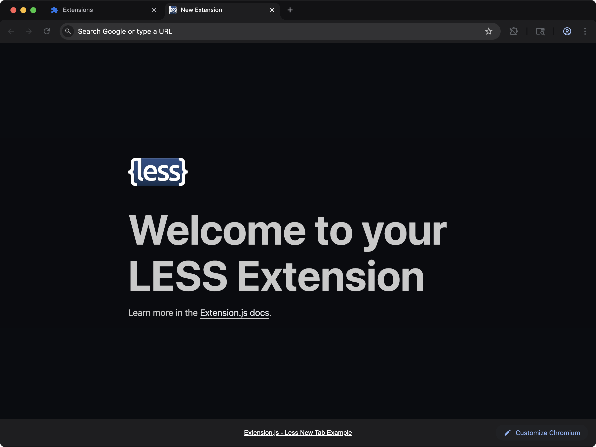</td>
    </tr>
    <tr><td>Version</td><td align="right">0.0.1</td></tr>
    <tr><td>Context</td><td align="right">New Tab, Background</td></tr>
    <tr><td>JavaScript framework</td><td align="right">JavaScript</td></tr>
    <tr><td>CSS</td><td align="right">Less</td></tr>
    <tr>
      <td>Background included</td>
      <td align="right">Yes</td>
      <td align="center"><a href="https://templates.extension.dev/new-less">Start with this template &#8599;</a></td>
    </tr>
  </table>

  
 New Preact Example

> New tab page example rendered with Preact. Loads a small Preact app you can extend.

  <table>
    <tr>
      <td>Repository</td>
      <td align="right"><a href="https://github.com/extension-js/examples/blob/main/examples/new-preact/README.md">examples/new-preact</a></td>
      <td rowspan="5">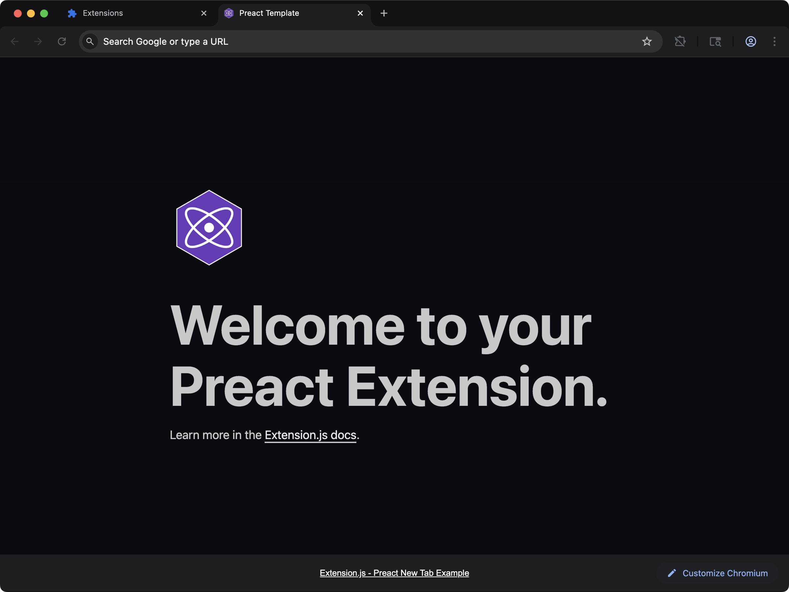</td>
    </tr>
    <tr><td>Version</td><td align="right">0.0.1</td></tr>
    <tr><td>Context</td><td align="right">New Tab, Background</td></tr>
    <tr><td>JavaScript framework</td><td align="right">Preact</td></tr>
    <tr><td>CSS</td><td align="right">CSS</td></tr>
    <tr>
      <td>Background included</td>
      <td align="right">Yes</td>
      <td align="center"><a href="https://templates.extension.dev/new-preact">Start with this template &#8599;</a></td>
    </tr>
  </table>

  
 New React Example

> A browser extension new tab page example built with Extension.js and React. Demonstrates a React-based new tab page with a working build and preview flow.

  <table>
    <tr>
      <td>Repository</td>
      <td align="right"><a href="https://github.com/extension-js/examples/blob/main/examples/new-react/README.md">examples/new-react</a></td>
      <td rowspan="5">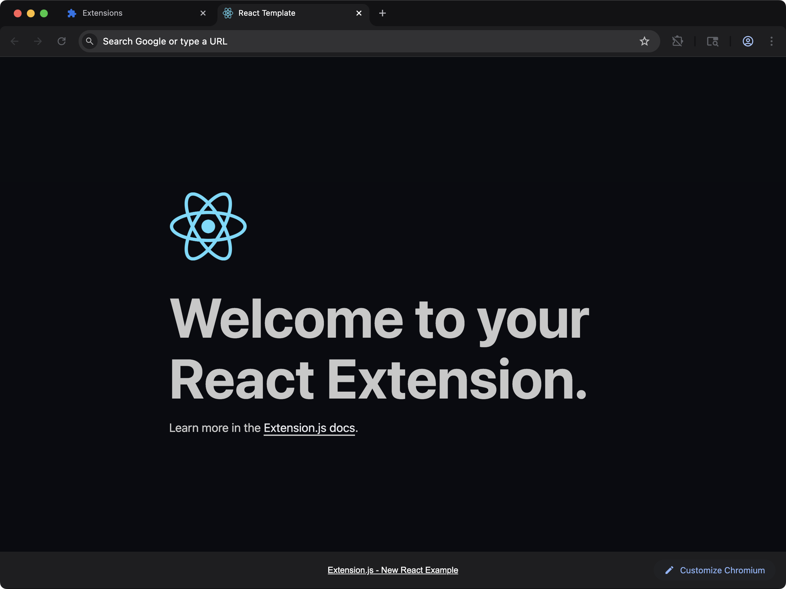</td>
    </tr>
    <tr><td>Version</td><td align="right">0.0.1</td></tr>
    <tr><td>Context</td><td align="right">New Tab, Background</td></tr>
    <tr><td>JavaScript framework</td><td align="right">React</td></tr>
    <tr><td>CSS</td><td align="right">CSS</td></tr>
    <tr>
      <td>Background included</td>
      <td align="right">Yes</td>
      <td align="center"><a href="https://templates.extension.dev/new-react">Start with this template &#8599;</a></td>
    </tr>
  </table>

  
 New React Router Example

> New tab page example using React Router. Shows multiple routes inside the new tab app.

  <table>
    <tr>
      <td>Repository</td>
      <td align="right"><a href="https://github.com/extension-js/examples/blob/main/examples/new-react-router/README.md">examples/new-react-router</a></td>
      <td rowspan="5"></td>
    </tr>
    <tr><td>Version</td><td align="right">0.0.1</td></tr>
    <tr><td>Context</td><td align="right">New Tab, Background</td></tr>
    <tr><td>JavaScript framework</td><td align="right">React</td></tr>
    <tr><td>CSS</td><td align="right">CSS</td></tr>
    <tr>
      <td>Background included</td>
      <td align="right">Yes</td>
      <td align="center"><a href="https://templates.extension.dev/new-react-router">Start with this template &#8599;</a></td>
    </tr>
  </table>

  
 New Sass Example

> New tab page example styled with Sass. Renders a simple page and organizes styles with Sass.

  <table>
    <tr>
      <td>Repository</td>
      <td align="right"><a href="https://github.com/extension-js/examples/blob/main/examples/new-sass/README.md">examples/new-sass</a></td>
      <td rowspan="5"></td>
    </tr>
    <tr><td>Version</td><td align="right">0.0.1</td></tr>
    <tr><td>Context</td><td align="right">New Tab, Background</td></tr>
    <tr><td>JavaScript framework</td><td align="right">JavaScript</td></tr>
    <tr><td>CSS</td><td align="right">Sass</td></tr>
    <tr>
      <td>Background included</td>
      <td align="right">Yes</td>
      <td align="center"><a href="https://templates.extension.dev/new-sass">Start with this template &#8599;</a></td>
    </tr>
  </table>

  
 New Svelte Example

> New tab page example rendered with Svelte. Loads a small Svelte app you can extend.

  <table>
    <tr>
      <td>Repository</td>
      <td align="right"><a href="https://github.com/extension-js/examples/blob/main/examples/new-svelte/README.md">examples/new-svelte</a></td>
      <td rowspan="5">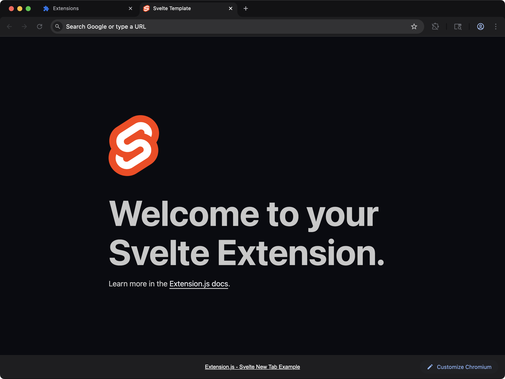</td>
    </tr>
    <tr><td>Version</td><td align="right">0.0.1</td></tr>
    <tr><td>Context</td><td align="right">New Tab, Background</td></tr>
    <tr><td>JavaScript framework</td><td align="right">Svelte</td></tr>
    <tr><td>CSS</td><td align="right">CSS</td></tr>
    <tr>
      <td>Background included</td>
      <td align="right">Yes</td>
      <td align="center"><a href="https://templates.extension.dev/new-svelte">Start with this template &#8599;</a></td>
    </tr>
  </table>

  
 New TypeScript Example

> A browser extension new tab page example built with Extension.js and TypeScript. Demonstrates a type-safe new tab page with a working build and preview flow.

  <table>
    <tr>
      <td>Repository</td>
      <td align="right"><a href="https://github.com/extension-js/examples/blob/main/examples/new-typescript/README.md">examples/new-typescript</a></td>
      <td rowspan="5">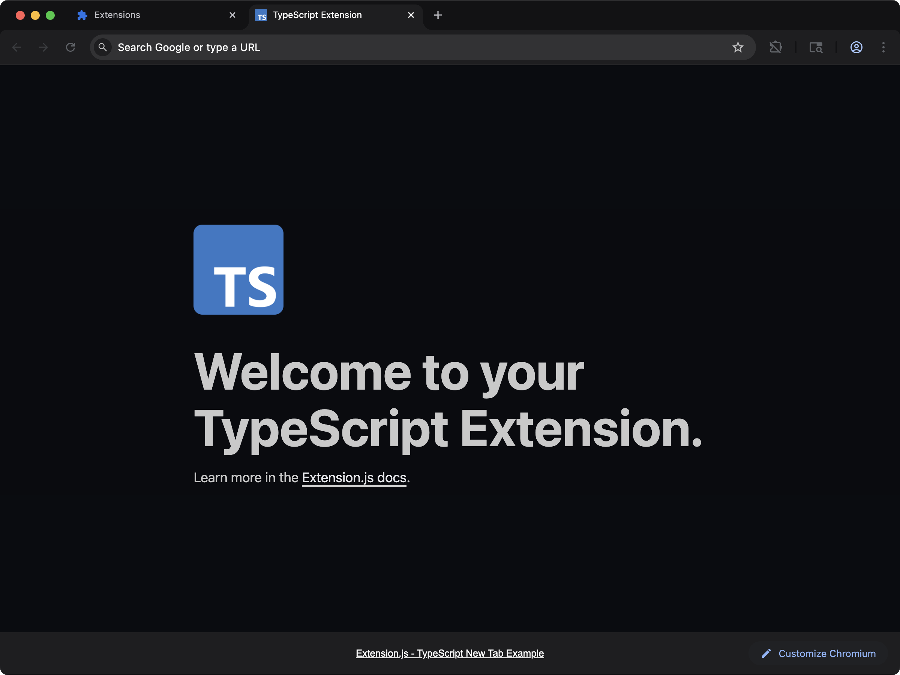</td>
    </tr>
    <tr><td>Version</td><td align="right">0.0.1</td></tr>
    <tr><td>Context</td><td align="right">New Tab, Background</td></tr>
    <tr><td>JavaScript framework</td><td align="right">JavaScript</td></tr>
    <tr><td>CSS</td><td align="right">CSS</td></tr>
    <tr>
      <td>Background included</td>
      <td align="right">Yes</td>
      <td align="center"><a href="https://templates.extension.dev/new-typescript">Start with this template &#8599;</a></td>
    </tr>
  </table>

  
 New Vue Example

> New tab page example rendered with Vue. Loads a small Vue app you can extend.

  <table>
    <tr>
      <td>Repository</td>
      <td align="right"><a href="https://github.com/extension-js/examples/blob/main/examples/new-vue/README.md">examples/new-vue</a></td>
      <td rowspan="5">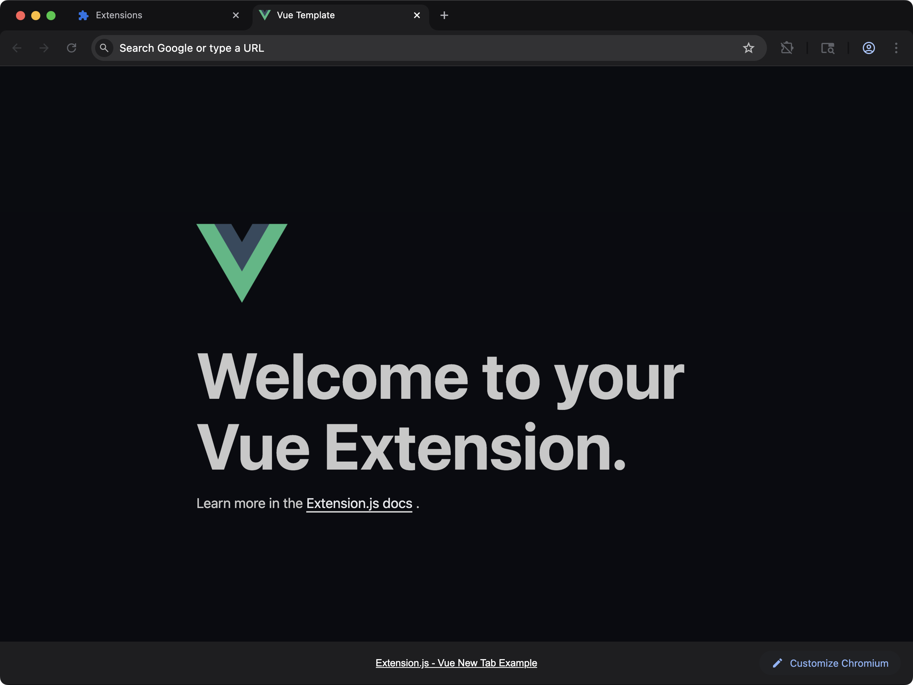</td>
    </tr>
    <tr><td>Version</td><td align="right">0.0.1</td></tr>
    <tr><td>Context</td><td align="right">New Tab, Background</td></tr>
    <tr><td>JavaScript framework</td><td align="right">Vue</td></tr>
    <tr><td>CSS</td><td align="right">CSS</td></tr>
    <tr>
      <td>Background included</td>
      <td align="right">Yes</td>
      <td align="center"><a href="https://templates.extension.dev/new-vue">Start with this template &#8599;</a></td>
    </tr>
  </table>

### Special folders

  
 Special Folders Pages Example

> Opens a welcome page on extension load, showcasing the pages/ folder.

  <table>
    <tr>
      <td>Repository</td>
      <td align="right"><a href="https://github.com/extension-js/examples/blob/main/examples/special-folders-pages/README.md">examples/special-folders-pages</a></td>
      <td rowspan="5">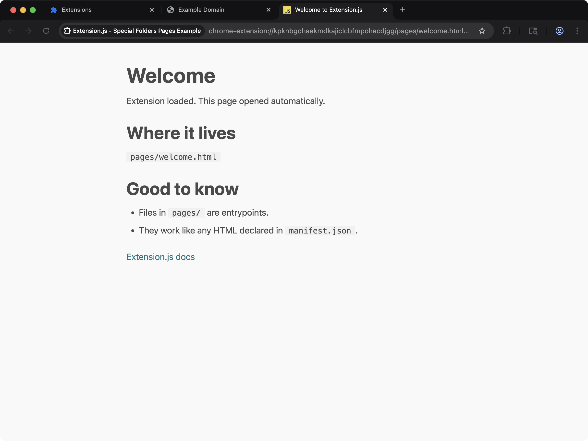</td>
    </tr>
    <tr><td>Version</td><td align="right">0.0.1</td></tr>
    <tr><td>Context</td><td align="right">Background</td></tr>
    <tr><td>JavaScript framework</td><td align="right">JavaScript</td></tr>
    <tr><td>CSS</td><td align="right">CSS</td></tr>
    <tr>
      <td>Background included</td>
      <td align="right">Yes</td>
      <td align="center"><a href="https://templates.extension.dev/special-folders-pages">Start with this template &#8599;</a></td>
    </tr>
  </table>

  
 Special Folders Scripts Example

> Demonstrates scripts/ folder organization and how to run standalone scripts via the extension.

  <table>
    <tr>
      <td>Repository</td>
      <td align="right"><a href="https://github.com/extension-js/examples/blob/main/examples/special-folders-scripts/README.md">examples/special-folders-scripts</a></td>
      <td rowspan="5">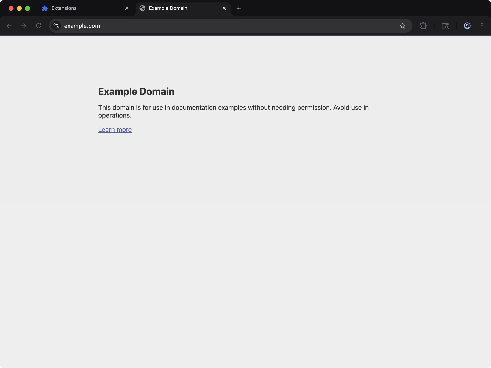</td>
    </tr>
    <tr><td>Version</td><td align="right">0.0.1</td></tr>
    <tr><td>Context</td><td align="right">Background</td></tr>
    <tr><td>JavaScript framework</td><td align="right">JavaScript</td></tr>
    <tr><td>CSS</td><td align="right">CSS</td></tr>
    <tr>
      <td>Background included</td>
      <td align="right">Yes</td>
      <td align="center"><a href="https://templates.extension.dev/special-folders-scripts">Start with this template &#8599;</a></td>
    </tr>
  </table>

### Utilities

  
 Init Example

> A basic browser extension example built with Extension.js. A starting point for developers learning current browser extension tooling.

  <table>
    <tr>
      <td>Repository</td>
      <td align="right"><a href="https://github.com/extension-js/examples/blob/main/examples/init/README.md">examples/init</a></td>
      <td rowspan="5"></td>
    </tr>
    <tr><td>Version</td><td align="right">0.0.1</td></tr>
    <tr><td>Context</td><td align="right"></td></tr>
    <tr><td>JavaScript framework</td><td align="right">JavaScript</td></tr>
    <tr><td>CSS</td><td align="right">CSS</td></tr>
    <tr>
      <td>Background included</td>
      <td align="right">No</td>
      <td align="center"><a href="https://templates.extension.dev/init">Start with this template &#8599;</a></td>
    </tr>
  </table>

## License

MIT (c) Cezar Augusto and the Extension.js authors.
