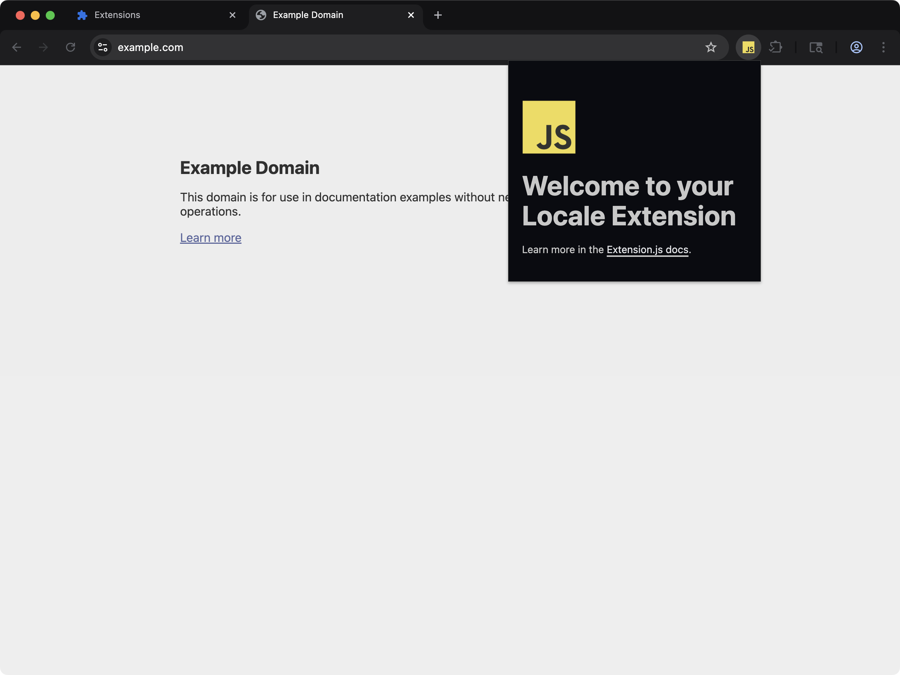

[powered-image]: https://img.shields.io/badge/Powered%20by-Extension.js-0971fe
[powered-url]: https://extension.js.org

[![Powered by Extension.js][powered-image]][powered-url]

# Action Popup (i18n / Locales) Example

> Action popup example demonstrating i18n with \_locales and message placeholders.



**What you'll see**: A toolbar popup that opens when you click the extension's icon.

**How it works**: The manifest registers an `action` and points `default_popup` at a JavaScript page bundled from `src/action/`.

Demonstrates the `_locales/` directory and `chrome.i18n.*` APIs. The popup pulls strings from the user's active locale; add another `_locales/<lang>/messages.json` to localize.

## Try it locally

```bash
npx extension@latest create my-action-locales --template action-locales
cd my-action-locales
npm install
npm run dev
```

A fresh browser window opens with the extension already loaded.

## Project layout

```
src/
├── _locales/
│   ├── en/
│   │   └── messages.json
│   └── pt_BR/
│       └── messages.json
├── action/
│   ├── index.html
│   ├── scripts.js
│   └── styles.css
├── images/
│   └── icon.png
├── background.js
└── manifest.json
```

## Commands

### dev

Run the extension in development mode. Target a browser with `--browser`:

```bash
npm run dev                 # Chromium (default)
npm run dev -- --browser=chrome
npm run dev -- --browser=edge
npm run dev -- --browser=firefox
```

### build

Build for production. Convenience scripts cover each browser:

```bash
npm run build           # Chrome (default)
npm run build:firefox
npm run build:edge
```

### preview

Preview the production build with the bundled browser:

```bash
npm run preview
```

## Tests

This template ships an end-to-end check (`template.spec.ts`) validated by the examples-repo CI on every commit.

## Learn more

- [Extension.js docs](https://extension.js.org)
- [Templates index](https://extension.js.org/docs/getting-started/templates)
- [GitHub: extension-js/extension.js](https://github.com/extension-js/extension.js)
