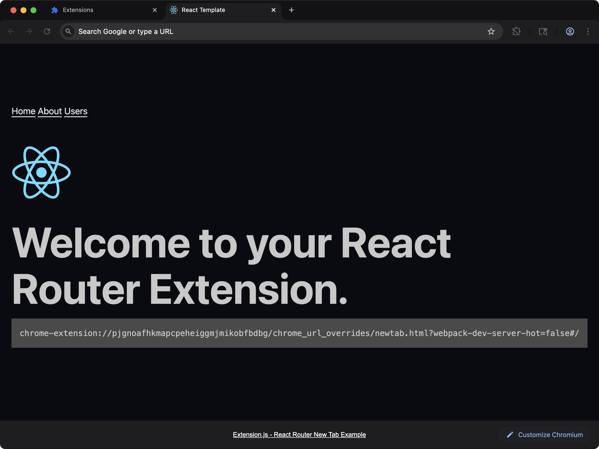

[powered-image]: https://img.shields.io/badge/Powered%20by-Extension.js-0971fe
[powered-url]: https://extension.js.org

[![Powered by Extension.js][powered-image]][powered-url]

# React New Tab Example

> New tab page example using React Router. Shows multiple routes inside the new tab app.



**What you'll see**: A custom new-tab page replacing the browser default.

**How it works**: The manifest overrides the new-tab page and loads a React + TypeScript entry bundled from `src/newtab/`.

A new-tab page driven by [React Router](https://reactrouter.com/). Useful for extension UIs that span multiple in-app routes.

## Try it locally

```bash
npx extension@latest create my-new-react-router --template new-react-router
cd my-new-react-router
npm install
npm run dev
```

A fresh browser window opens with the extension already loaded.

## Project layout

```
src/
├── images/
│   └── icon.png
├── newtab/
│   ├── index.html
│   ├── NewTabApp.tsx
│   ├── scripts.tsx
│   └── styles.css
├── background.js
└── manifest.json
```

## Commands

### dev

Run the extension in development mode. Target a browser with `--browser`:

```bash
npm run dev                 # Chromium (default)
npm run dev -- --browser=chrome
npm run dev -- --browser=edge
npm run dev -- --browser=firefox
```

### build

Build for production. Convenience scripts cover each browser:

```bash
npm run build           # Chrome (default)
npm run build:firefox
npm run build:edge
```

### preview

Preview the production build with the bundled browser:

```bash
npm run preview
```

## Tests

This template ships an end-to-end check (`template.spec.ts`) validated by the examples-repo CI on every commit.

## Learn more

- [Extension.js docs](https://extension.js.org)
- [Templates index](https://extension.js.org/docs/getting-started/templates)
- [GitHub: extension-js/extension.js](https://github.com/extension-js/extension.js)
