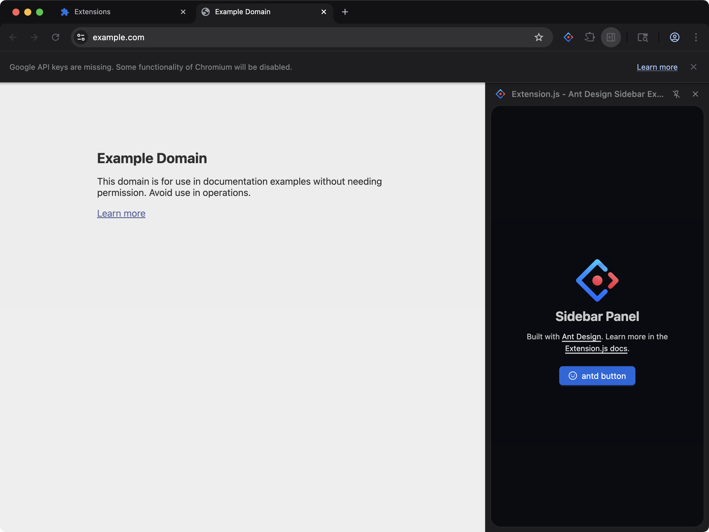

[powered-image]: https://img.shields.io/badge/Powered%20by-Extension.js-0971fe
[powered-url]: https://extension.js.org

[![Powered by Extension.js][powered-image]][powered-url]

# React Sidebar (Ant Design) Example

> React sidebar using antd and @ant-design/x. Regression coverage for issue #445.



**What you'll see**: A browser side panel that loads when you open the sidebar.

**How it works**: The manifest registers a side panel (`chromium:side_panel` / `firefox:sidebar_action`) that loads a React page bundled from `src/sidebar/`. UI is composed with Ant Design.

React sidebar rendering [Ant Design](https://ant.design/) and [Ant Design X](https://x.ant.design/) components. Doubles as regression coverage for [issue #445](https://github.com/extension-js/extension.js/issues/445) — the bundler's exports-condition resolution must route CJS requires through `require` so `@babel/runtime` helpers don't crash with `_interopRequireDefault is not a function`.

## Try it locally

```bash
npx extension@latest create my-sidebar-antd --template sidebar-antd
cd my-sidebar-antd
npm install
npm run dev
```

A fresh browser window opens with the extension already loaded.

## Project layout

```
src/
├── images/
│   └── icon.png
├── sidebar/
│   ├── index.html
│   ├── scripts.jsx
│   ├── SidebarApp.jsx
│   └── styles.css
├── background.js
└── manifest.json
```

## Commands

### dev

Run the extension in development mode. Target a browser with `--browser`:

```bash
npm run dev                 # Chromium (default)
npm run dev -- --browser=chrome
npm run dev -- --browser=edge
npm run dev -- --browser=firefox
```

### build

Build for production. Convenience scripts cover each browser:

```bash
npm run build           # Chrome (default)
npm run build:firefox
npm run build:edge
```

### preview

Preview the production build with the bundled browser:

```bash
npm run preview
```

## Tests

This template ships an end-to-end check (`template.spec.ts`) validated by the examples-repo CI on every commit.

## Learn more

- [Extension.js docs](https://extension.js.org)
- [Templates index](https://extension.js.org/docs/getting-started/templates)
- [GitHub: extension-js/extension.js](https://github.com/extension-js/extension.js)
